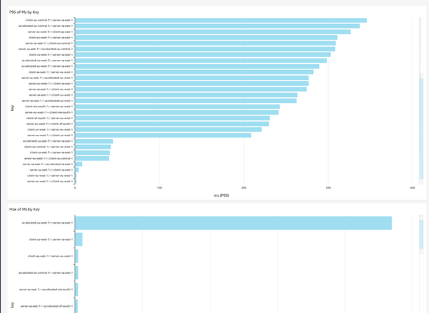

# performance-tester

A basic dotnet relaying client and server project, that measures point ot point elapsed network time across inbound and relayed messages, and optionally logs the metrics to a Kinesis FireHose from every receiving client, and the server.

Both components come with Dockerfiles, built-in help and shell scripts launchers to show how to run

## Building

Run `dotnet build` in the root directory

## Containerizing

In each sub directory, there is a file called `build-container.sh` that show how to containerize each component, but it essentially just does a `docker build`

## Running

In each sub directory there is a shell script called `run-container.sh` that shows an example of how to run the client and the server components together

## Help

Each component has a full built in help, displayed with a `-h` switch, or in the case of miss-configuration

## Overview

## Infrastructure and architecture

The client and server each need to be run in multiple regions, eg. `eu-west-1,af-south-1,sa-east-1,ap-east-1,me-south-1,eu-central-1,us-west-1`.
We need one server per region, and a few clients, pointing to each possible server, to create a mesh.

### ECR

The first step here is to replicate these docker images to regional repositories. For this we recommend using the Amazon ECR repositories cross-region replication CloudFormation stack [from the aws samples github](https://github.com/aws-samples/amazon-ecr-cross-region-replication).

### VPC

We run ECS Fargate in a VPC with 2 public subnets, and an NLB for all ingress.

For security, we need to create VPC endpoints bound to the 2 subnets, for the following services

- S3
- ECR API
- ECR DKM
- CloudWatch Logs

This means that ECS doesn't need any direct access to the internet.

For more on this, please refer to [the guide here](https://docs.aws.amazon.com/AmazonECR/latest/userguide/vpc-endpoints.html)

### Fargate

The Fargate Services don't use Public IP addresses, but instead we use VPC endpoints to expose the docker images to ECS.

We use Environment variables in the Task Definitions to configure the containers.

### QuickSight

Using the S3 -> Athena -> Quicksight standard pipeline you can easily pull up a dashboard

